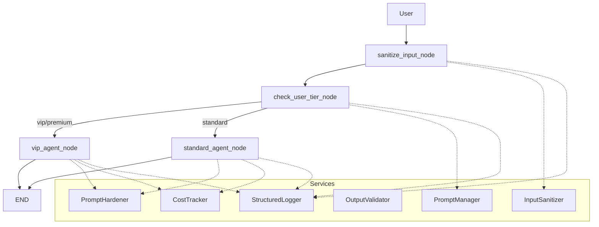

# Support Agent with Prompt Versioning, Structured Output, Cost Tracking, and Injection Defense

## Project Overview
This project implements a customer support agent pipeline that demonstrates five improvements:
- Prompt versioning and rollback for reproducible prompts.
- Pydantic-structured outputs for reliable parsing.
- Robust error handling with retries and rate limiting.
- Centralized LLM cost tracking (per-call and per-tier summaries).
- Prompt-injection defenses (sanitization, hardening, and output validation).

## Implementation Details (Tasks)
1. Task 1 — Prompt Versioning
   - Implemented `PromptManager` to load versioned prompts from `prompts/agents/customer_support`.
   - Prints available versions and active "current" pointer; supports rollback and history.

2. Task 2 — Structured Output (Pydantic)
   - Uses Pydantic models (`RoutingDecision`, `EscalationDecision`, `SupportResponse`, `SupportOutput`) to enforce schema for LLM responses.
   - Demonstrated examples printed in human-readable form.

3. Task 3 — Error Handling with Retries
   - Added `retry_with_backoff` on LLM/tool nodes, custom error classes, and a `RateLimiter`.
   - Structured logging via `StructuredLogger` and human-readable prints for demo sections.

4. Task 4 — Cost Tracking
   - Centralized cost computation in `CostTracker`; helper `_extract_token_usage` extracts tokens from various LLM response shapes.
   - `_track_and_append_cost` calls `CostTracker.track_llm_call` and aggregates results into `state['request_costs']` and `state['cost_summary']` (split `vip` vs `standard`).
   - A single human-readable Task 4 summary is printed after orchestration (no hardcoded token/cost values remain in active logic; originals preserved as comments near replacements).

5. Task 5 — Prompt Injection Defense
   - `InputSanitizer` performs sanitization and detection; `PromptHardener` applies sandwich defenses; `OutputValidator` validates final messages.
   - A `sanitize_input_node` runs before tier-checking and sets flags for suspicious inputs.

## Architecture Diagram (text)

Embedded diagram (Mermaid supported platforms will render this):



If your editor does not render Mermaid, see `ARCHITECTURE.md` for an ASCII diagram and the same Mermaid source.

## Setup Instructions
1. Create a Python environment (recommended: 3.10+):

```bash
python -m venv .venv
.\.venv\Scripts\activate
```

2. Install dependencies:

```bash
pip install -r requirements.txt
```

3. Run the agent demo:

```bash
python week2-assignment\agent.py
```

Notes: If Redis is available and configured, `CostTracker` will attempt to use it (falls back to in-memory storage automatically).

## Testing
- Quick run: `python week2-assignment\agent.py` — output should display Tasks 1→2→3 (plain prints), Task 4 cost summary, then Task 5 outputs.
- Unit/test harness: see `week2-assignment/tests/run_cost_tests.py` which mocks LLM responses of different shapes to validate `_extract_token_usage` and `_track_and_append_cost`.
- Example input used by demo: "I am a VIP customer and need help with my order" — expected behavior: VIP routing, VIP agent response, Task 4 cost summary printed once.

## Security Choice
Selected defenses:
- Input sanitization (detect suspicious tokens, encoding, repetition).
- Prompt hardening (sandwich defense: secure system prompt wrapper).
- Output validation (schema checks via Pydantic and safe fallback messages).

Rationale: Combining sanitization, prompt hardening, and strict output validation gives layered defense where malformed or malicious inputs are detected early, prompts are hardened to resist injection, and outputs are validated before returning to users.

## Challenges Faced
- Multiple LLM response shapes required a resilient token-extraction strategy; solved by `_extract_token_usage` which handles dicts, attributes, and fallback estimates.
- Removing hardcoded token/cost values while preserving auditability: resolved by keeping original hardcoded snippets commented nearby and using `CostTracker` as the single source of truth.
- Balancing structured telemetry vs clean user-facing output: implemented both — structured logs for telemetry and plain `print()` for human-readable Task outputs.

## Future Improvements
- Enforce pre-call budget checks for all nodes (currently applied to VIP; extend to standard agent).
- Convert test harness to pytest-based unit tests and add CI.
- Add persistent storage for conversation histories and per-user budgets (Redis-backed features).
- Add optional feature flags to toggle heavy telemetry on/off.

---

If you want, I can:
- Add a short `README` section showing sample outputs captured from a recent run,
- Convert `week2-assignment/tests/run_cost_tests.py` to `pytest` tests,
- Or remove remaining structured JSON logs so console output contains only plain text prints.
